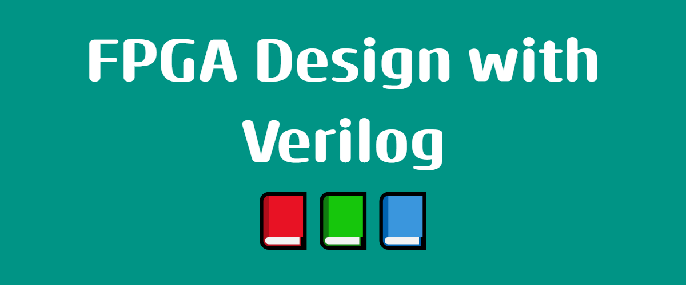

## Documentación
[Ir a documentación](https://cirofabianbermudez.com/curso_fpga/)

## Colaboradores
- Julisa Verdejo Palacios
- Alonso Contreras Guadalupe
- Bermudez Marquez Ciro Fabian

## Referencias
- [DigitalWiki](http://digital.unex.es/wiki/doku.php?id=pub:vlog#sintaxis_verilog)
- [VerilogGuide](https://verilogguide.readthedocs.io/en/latest/index.html)
- [FpgaKey](https://www.fpgakey.com/tutorial/)
