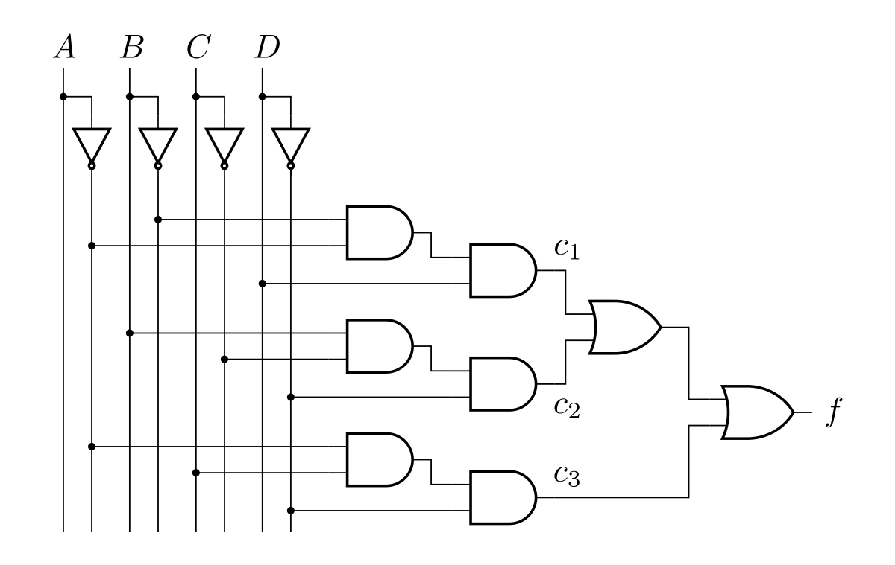

# Look Up Tables

## 1. Códigos

### 1.1. Función booleana

$$
f(A,B,C,D) = (\overline{A}  \cdot \overline{B} \cdot D) + (B \cdot \overline{C} \cdot \overline{D}) + (\overline{A} \cdot C \cdot \overline{D})
$$

<figure markdown>
  <figcaption> <b>Tabla 1.</b> Tabla de verdad de función boolena.</figcaption>

| Decimal | $A$  | $B$  | $C$  | $D$  |  $f$  |
| :-----: | :--: | :--: | :--: | :--: | :---: |
|    0    |  0   |  0   |  0   |  0   |   0   |
|    1    |  0   |  0   |  0   |  1   | **1** |
|    2    |  0   |  0   |  1   |  0   | **1** |
|    3    |  0   |  0   |  1   |  1   | **1** |
|    4    |  0   |  1   |  0   |  0   | **1** |
|    5    |  0   |  1   |  0   |  1   |   0   |
|    6    |  0   |  1   |  1   |  0   | **1** |
|    7    |  0   |  1   |  1   |  1   |   0   |
|    8    |  1   |  0   |  0   |  0   |   0   |
|    9    |  1   |  0   |  0   |  1   |   0   |
|   10    |  1   |  0   |  1   |  0   |   0   |
|   11    |  1   |  0   |  1   |  1   |   0   |
|   12    |  1   |  1   |  0   |  0   | **1** |
|   13    |  1   |  1   |  0   |  1   |   0   |
|   14    |  1   |  1   |  1   |  0   |   0   |
|   15    |  1   |  1   |  1   |  1   |   0   |

</figure>

[Download `lut1.v` :material-download:](https://github.com/cirofabianbermudez/curso_fpga/blob/main/codes/01_combinacionales/01_lut/lut1.v){:target="_blank" .md-button }

``` verilog title="lut1.v" linenums="1"
--8<-- "codes/01_combinacionales/01_lut/lut1.v:6"
```

### 1.2. Diagrama esquemático

<figure markdown>
  { width="700" }
  <figcaption><b>Figura 2.</b> Diagrama esquemático de circuito combinacional.</figcaption>
</figure>


``` verilog title="lut2.v" linenums="1"
--8<-- "codes/01_combinacionales/01_lut/lut2.v:6"
```

### 1.3. Mintérminos
También se les conoce como suma de productos o SOP (Sum Of Products).

<figure markdown>
  <figcaption> <b>Tabla 2.</b> Tabla de verdad.</figcaption>

| Decimal | $A$  | $B$  | $C$  | $D$  | $f$  |
| :-----: | :--: | :--: | :--: | :--: | :--: |
|   ...   |  ...   |  ...   |  ...   |  ...   |  0  |
|   11    |  1   |  0   |  1   |  1   |  1   |
|   13    |  1   |  1   |  0   |  1   |  1   |

</figure>


=== "Versión 1"

    ``` verilog title="lut4.v" linenums="1"
    --8<-- "codes/01_combinacionales/01_lut/lut4.v:6"
    ```

=== "Versión 2"

    ``` verilog title="lut5.v" linenums="1"
    --8<-- "codes/01_combinacionales/01_lut/lut5.v:6"
    ```

## 2. Verificación
### 2.1. Testbench

[Download `lut_tb.v` :material-download:](https://github.com/cirofabianbermudez/curso_fpga/blob/main/codes/01_combinacionales/01_lut/lut_tb.v){:target="_blank" .md-button }

``` verilog title="lut_tb.v" linenums="1"
--8<-- "codes/01_combinacionales/01_lut/lut_tb.v:6"
```

### 2.2. Resultados
```plain title="lut_tb_output.txt" linenums="1"
--8<-- "codes/01_combinacionales/01_lut/lut_tb_output.out"
```

## 3. Referencias
[^1]: Russell, “Tutorial - Boolean Algebra using Look-Up Tables (LUTs)”, *Nandland*, el 9 de junio de 2022. [https://nandland.com/lesson-4-what-is-a-look-up-table-lut](https://nandland.com/lesson-4-what-is-a-look-up-table-lut) (consultado el 17 de julio de 2023).
[^2]: “Quine–McCluskey algorithm”. [https://www.mathematik.uni-marburg.de/~thormae/lectures/ti1/code/qmc](https://www.mathematik.uni-marburg.de/~thormae/lectures/ti1/code/qmc) (consultado el 17 de julio de 2023).
[^3]: “Gate Level Modeling”, ChipVerify. [https://www.chipverify.com/verilog/verilog-gate-level-modeling](https://www.chipverify.com/verilog/verilog-gate-level-modeling) (consultado el 17 de julio de 2023).
