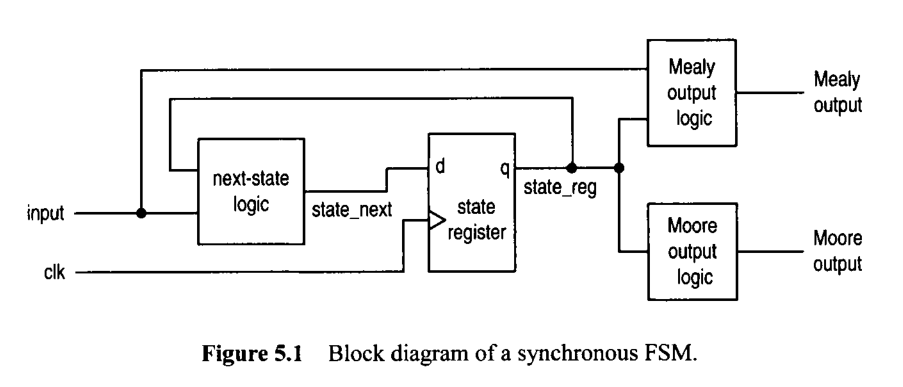

# FSM Moore


<figure markdown>
  { width="600" }
</figure>


``` verilog title="template_moore.v" linenums="1"
module moore_regular_template
#( parameter
        param1 : <value>,
        param2 : <value>
)
(
    input wire clk, reset,
    input wire [<size>] input1, input2, ...,
    output reg [<size>] output1, output2
); 

localparam [<size_state>] // for 4 states : size_state = 1:0
    s0 = 0,
    s1 = 1,
    s2 = 2,
    ... ;
    
    reg[<size_state>] state_reg, state_next;  

// state reg
always @(posedge clk, posedge reset) begin
    if (reset) begin
        state_reg <= s1;
    end
    else begin
        state_reg <= state_next;
    end
end 

// next state logic :
always @(input1, input2, state_reg) begin 
    state_next = state_reg; // default state_next
    case (state_reg)
        s0 : begin
            if (<condition>) begin  // if (input1 = 2'b01) then
                state_next = s1; 
            end
            else if (<condition>) begin  // add all the required conditionstion
                state_next = ...; 
            end
            else begin // remain in current state
                state_next = s0; 
            end
        end
        s1 : begin
            if (<condition>) begin // if (input1 = 2'b10) then
                state_next = s2; 
            end
            else if (<condition>) begin // add all the required conditionstions
                state_next = ...; 
            end
            else begin// remain in current state
                state_next = s1; 
            end
        end
        s2 : begin
            ...
        end
    endcase
end 
    
// Moore output logic
always @(input1, input2, ..., state_reg) begin
    // default outputs
    output1 = <value>;
    output2 = <value>;
    ...
    case (state_reg)  
        s0 : begin
            output1 = <value>;
            output2 = <value>;
            ...
        end
        s1 : begin
            output1 = <value>;
            output2 = <value>;
            ...
        end
        s2 : begin
            ...
        end
    endcase
end 
    

endmodule
```


``` verilog title="template_moore_combined.v" linenums="1"
// moore_regular_template2.v

module moore_regular_template2
#( parameter
        param1 : <value>,
        param2 : <value>
)
(
    input wire clk, reset,
    input wire [<size>] input1, input2, ...,
    output reg [<size>] output1, output2
); 

localparam [<size_state>] // for 4 states : size_state = 1:0
    s0 = 0,
    s1 = 1,
    s2 = 2,
    ... ;
    
    reg[<size_state>] state_reg, state_next;  


// state register : state_reg
always @(posedge clk, posedge reset) begin
    if (reset) begin
        state_reg <= s1;
    end
    else begin
        state_reg <= state_next;
    end
end 

// next state logic
// Moore output logic
always @(input1, input2, state_reg) begin 
    state_next = state_reg; // default state_next
    case (state_reg)
        s0 : begin
            output1 = <value>;
            output2 = <value>;
            ...
            if (<condition>) begin  // if (input1 = 2'b01) then
                state_next = s1; 
            end
            else if (<condition>) begin  // add all the required conditionstion
                state_next = ...; 
            end
            else begin // remain in current state
                state_next = s0; 
            end
        end
        s1 : begin
            output1 = <value>;
            output2 = <value>;
            ...
            if (<condition>) begin // if (input1 = 2'b10) then
                state_next = s2; 
            end
            else if (<condition>) begin // add all the required conditionstions
                state_next = ...; 
            end
            else begin// remain in current state
                state_next = s1; 
            end
        end
        s2 : begin
            ...
        end
    endcase
end 

endmodule
```