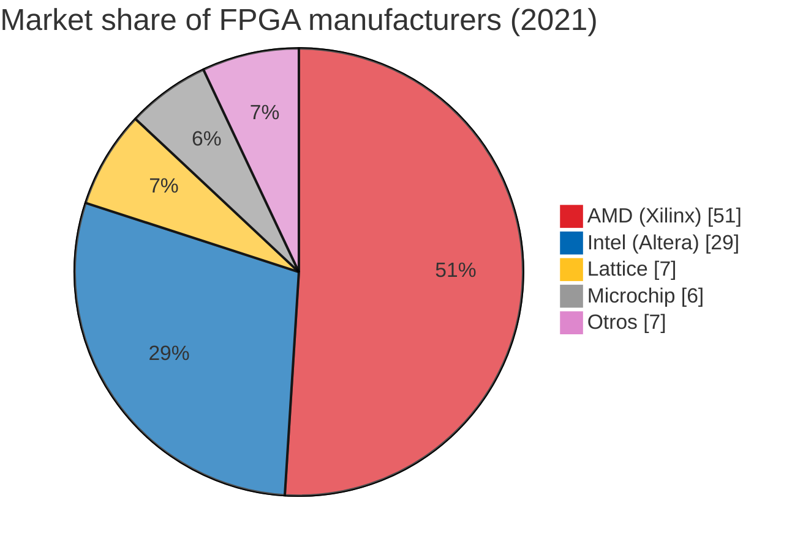

# FPGAs

## 2. FPGAs

### 2.1. ¿Qué es una FPGA?

Las FPGAs (Field Programmable Gate Arrays) son circuitos integrados que permiten a los diseñadores programar lógica digital personalizada en el que la función puede definirse después de la fabricación. Una FPGA permite programar características y funciones de productos, adaptarse a nuevos estándares y reconfigurar el hardware para aplicaciones específicas incluso después de instalar el producto sobre el campo, de ahí el término programable sobre el terreno. Y las matrices de compuertas son matrices bidimensionales de compuertas lógicas. Si se juntan suficientes de estas cosas, se puede hacer que esos cálculos simples se sumen para hacer algo significativo.

### 2.2. ¿Qué FPGA elegir?

En el mundo, existen cuatro destacadas compañías fabricantes de FPGAs: **AMD (Xilinx), Intel (Altera), Lattice** y **Microchip**. La cuota de mercado para el año 2021 se refleja en la siguiente gráfica:

AMD (Xilinx) domina casi la mitad del mercado con una participación del 51%, seguida por Intel (Altera), que cuenta con el 29%, Lattice con un 7%, Microchip con un 6%. El 7% restante se reparten Otros competidores. 

[Comparacion](https://www.terasic.com.tw/attachment/archive/1081/image/de10-standard-C.jpg)

<figure markdown>
  <figcaption> <b>Tabla 2.</b> FPGAs recomendadas.</figcaption>

| FPGA                                                         | Logic Elementes | Clock Source | SoC/HPS | Empresa  | Precio  |
| ------------------------------------------------------------ | --------------- | ------------ | :-----: | :------: | :-----: |
| [Basys 3 Digilent](https://digilent.com/shop/basys-3-artix-7-fpga-trainer-board-recommended-for-introductory-users/) | 33,280          | 100 MHz      |         | Digilent | $165.00 |
| [Nexys A7 Digilent](https://digilent.com/shop/nexys-a7-fpga-trainer-board-recommended-for-ece-curriculum/) | 101,440         | 100 MHz      |         | Digilent | $349.00 |
| [ZedBoard Zynq-7000 Digilent](https://digilent.com/shop/nexys-a7-fpga-trainer-board-recommended-for-ece-curriculum/) | 85K             | 100 MHz      |    ✓    | Digilent | $589.00 |
| [DE10-Nano Kit Terasic](https://www.terasic.com.tw/cgi-bin/page/archive.pl?Language=English&CategoryNo=167&No=1046) | 110K            | 50 MHz       |    ✓    | Terasic  | $225.00 |
| [DE1-SoC Board](http://www.terasic.com.tw/cgi-bin/page/archive.pl?Language=English&CategoryNo=165&No=836#contents) | 85K             | 50 MHz       |    ✓    | Terasic  | $377.00 |
| [DE10-Standard Terasic](https://www.terasic.com.tw/cgi-bin/page/archive.pl?Language=English&CategoryNo=165&No=1081#contents) | 110K            | 50 MHz       |    ✓    | Terasic  | $499.00 |

</figure>

