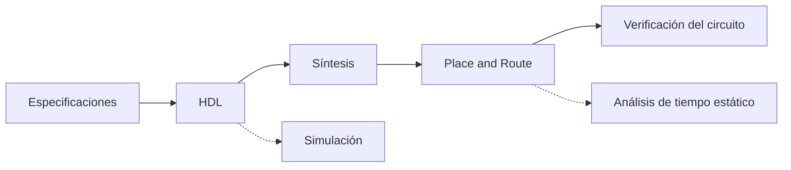

# Getting started

## 1. Introducción

### 1.1. ¿Qué es Verilog?

[Verilog](https://www.verilog.com/) es un lenguaje de descripción de hardware o HDL (Hardware Description Language) que es utilizado para describir sistemas digitales como una memoria, un sumador, una ALU, un controlador o un microprocesador. Permite a los diseñadores diseñar a varios niveles de abstracción. Es el HDL más utilizado y cuenta con una comunidad de usuarios de más de 50.000 diseñadores activos.

### 1.2. Plataformas
Existen diversas plataformas para trabajar con Verilog, entre las más populares se encuentran:

- [Aldec-HDL Student Edition](https://www.aldec.com/en/products/fpga_simulation/active_hdl_student)
- [Vivado ML Edition](https://www.xilinx.com/products/design-tools/vivado/vivado-ml.html)
- [Intel Quartus Prime Lite Edition](https://www.intel.la/content/www/xl/es/products/details/fpga/development-tools/quartus-prime/resource.html)
- [Icarus Verilog](https://bleyer.org/icarus/)

sin embargo, a pesar de que todas estas opciones cuentan con sus versiones gratuitas, no todas están disponibles en todos los sistemas operativos, en la siguiente tabla se muestran las diferentes compatibilidades:

<figure markdown>
  <figcaption> <b>Tabla 1.</b> Compabilidad en diferentes sistemas operativos.</figcaption>

| Software                                                     | Linux | Windows | Mac  |
| ------------------------------------------------------------ | :---: | :-----: | :--: |
| [Aldec-HDL Student Edition](https://www.aldec.com/en/products/fpga_simulation/active_hdl_student) |       |    ✓    |      |
| [Vivado ML Edition](https://www.xilinx.com/products/design-tools/vivado/vivado-ml.html) |   ✓   |    ✓    |      |
| [Intel Quartus Prime Lite Edition](https://www.intel.la/content/www/xl/es/products/details/fpga/development-tools/quartus-prime/resource.html) |   ✓   |    ✓    |      |
| [Icarus Verilog](https://bleyer.org/icarus/)                 |   ✓   |    ✓    |  ✓   |

</figure>

por lo anterior, es buena idea comenzar a trabajar con Verilog utilizando [Icarus Verilog](https://bleyer.org/icarus/), el cual es un compilador libre ([open source](https://www.redhat.com/en/topics/open-source/what-is-open-source)) para el lenguaje de descripción de hardware [IEEE-1364-2005](https://ieeexplore.ieee.org/document/1620780) Verilog.

A diferencia de las otras opciones los cuales cuentan con GUI (Graphical User Interface) y programas adicionales, [Icarus Verilog](https://bleyer.org/icarus/) funciona desde terminal y solo cuenta con herramientas necesarias para analizar, compilar y simular el código Verilog.

Las principales ventajas que cuenta esta herramienta sobre las otras son: 

1. Es muy ligera y fácil de instalar.
2. Es compatible con Linux, Windows y Mac.
3. Su compilador es rápido, muy robusto y estricto.

El instalador del programa pesa aproximadamente 20MB y el programa instalado en disco utiliza 80MB. A diferencia de [Aldec-HDL Student Edition](https://www.aldec.com/en/products/fpga_simulation/active_hdl_student) el cual es muy permisivo con los errores en el código, [Icarus Verilog](https://bleyer.org/icarus/) es muy estricto, lo que se traduce en un código que tienes mayores posibilidades de ser sintetizado sin inconvenientes. 

La ventaja de instalar [Vivado ML Edition](https://www.xilinx.com/products/design-tools/vivado/vivado-ml.html) o [Intel Quartus Prime Lite Edition](https://www.intel.la/content/www/xl/es/products/details/fpga/development-tools/quartus-prime/resource.html) es que cuentan con todas las herramientas necesarias para llevar a cabo de manera completa el flujo de diseño en FPGA. En el siguiente diagrama se muestra el flujo de diseño en FPGA[^1]:


Una de las estrategias más comunes al trabajar con Verilog es primero compilar y simular el código en [Icarus Verilog](https://bleyer.org/icarus/) y una vez probado pasar a [Vivado ML Edition](https://www.xilinx.com/products/design-tools/vivado/vivado-ml.html) o [Intel Quartus Prime Lite Edition](https://www.intel.la/content/www/xl/es/products/details/fpga/development-tools/quartus-prime/resource.html) para realizar la síntesis, el place and route y generar el archivo de programación para la FPGA. La ventaja de hacerlo de esta manera es que la compilación y la simulación es más rápida en [Icarus Verilog](https://bleyer.org/icarus/), lo que se traduce en un ahorro en el tiempo de diseño.

Para poder visualizar las formas de onda generadas por [Icarus Verilog](https://bleyer.org/icarus/) se utiliza el programa [GTKWave](https://gtkwave.sourceforge.net/) el cual es un completo visor de ondas basado en GTK+ para Unix, Win32 y Mac OSX que lee archivos LXT, LXT2, VZT, FST y GHW, así como archivos estándar Verilog VCD/EVCD y permite su visualización.

## 2. Instalación de Icarus

### 2.1. Windows
La manera recomendada para realizar la instalación en Windows es utilizando [Scoop](https://scoop.sh/), un instalador de línea de comandos diseñado específicamente para Windows. A continuación se muestran los pasos para instalar [Scoop](https://scoop.sh/) e [Icarus Verilog](https://bleyer.org/icarus/).

???+ note "Nota 1."
    Se sugiere visitar la página oficial de [Scoop](https://scoop.sh/) para verificar si ha habido cambios en los comandos de instalación. La información fue revisada por última vez el 29/07/2023.
    
???+ note "Nota 2."
    Si se instala [Icarus Verilog](https://bleyer.org/icarus/) de manera manual es necesario agregar la carpeta de instalación al `PATH`.

1. Abrir una terminal de [PowerShell](https://learn.microsoft.com/es-mx/powershell/)  o Windows PowerShell y ejecutar las siguientes dos lineas de comando para instalar [Scoop](https://scoop.sh/) :
``` plain linenums="1"
Set-ExecutionPolicy RemoteSigned -Scope CurrentUse
irm get.scoop.sh | iex
```
2.  Una vez instalado, ejecutar el comando siguiente comando para verificar que la instalación fue exitosa:
``` plain linenums="1"
scoop --version
```
3. Ejecutar el siguiente comando para instalar [Icarus Verilog](https://bleyer.org/icarus/):
``` plain linenums="1"
scoop install iverilog
```
4. Verificar que la instalación fue exitosa ejecutando los siguientes comandos:
``` plain linenums="1"
scoop list
iverilog
```
5. En Windows, al instalar [Icarus Verilog](https://bleyer.org/icarus/) se incluye preinstalado el visor de formas de ondas [GTKWave](https://gtkwave.sourceforge.net/), para verificar que funciona correctamente, ejecuta el siguiente comando:
``` plain linenums="1"
gtkwave --version
gtkwave
```

### 2.2. Linux
Para sistemas operativos Linux basados en Debian/Ubuntu la instalación más sencilla. Seguir los siguientes pasos:

1. Abrir una terminal  y ejecutar el siguiente comando para instalar [Icarus Verilog](https://bleyer.org/icarus/) y [GTKWave](https://gtkwave.sourceforge.net/):
``` plain linenums="1"
sudo apt install iverilog gtkwave
```

3. Verificar que la instalación fue exitosa ejecutando los siguientes comandos:
``` plain linenums="1"
iverilog
gtkwave --version
gtkwave
```

### 2.3. Mac
La manera recomendada para realizar la instalación en macOS es utilizando el gestor de paquetes [Homebrew](https://brew.sh/). A continuación se muestran los pasos para instalar [Homebrew](https://brew.sh/) e [Icarus Verilog](https://bleyer.org/icarus/)[^2] .

???+ note "Nota 3."
    Se sugiere visitar la página oficial de [Homebrew](https://brew.sh/) para verificar si ha habido cambios en los comandos de instalación. La información fue revisada por última vez el 29/07/2023.

1. Abrir una terminal y ejecutar el siguiente comando para instalar [Homebrew](https://brew.sh/):
``` plain linenums="1"
/bin/bash -c "$(curl -fsSL https://raw.githubusercontent.com/Homebrew/install/HEAD/install.sh)"
```
2. Ejecutar el siguiente comando para instalar [Icarus Verilog](https://bleyer.org/icarus/):
``` plain linenums="1"
brew install icarus-verilog
```
3. Descargar desde la página oficial [GTKWave](https://gtkwave.sourceforge.net/) para obtener la última versión, es un archivo `.zip`, descomprimirlo y darle el acceso requerido. Alternativamente ejecutar el siguiente comando, la versión pude ser más vieja:
``` plain linenums="1"
brew install --cask gtkwave
```
4. Verificar que la instalación fue exitosa ejecutando los siguientes comandos:
``` plain linenums="1"
iverilog
gtkwave --version
gtkwave
```

## 3. ¿Cómo utilizar Icarus?

Para aprender a utilizar [Icarus Verilog](https://bleyer.org/icarus/) y [GTKWave](https://gtkwave.sourceforge.net/) consideremos el siguiente circuito combinacional, que esta definido por la siguiente ecuación booleana:

$$
f(A,B,C) = (\overline{A} \cdot C) + (B \cdot C)
$$

y cuya tabla de verdad es la siguiente:

<figure markdown>
  <figcaption> <b>Tabla 2.</b> Tabla de verdad de función boolena.</figcaption>

| Decimal | $A$  | $B$  | $C$  | $f(A,B,C)$ |
| :--: | :--: | :--: | :--: | :--------: |
| 0  | 0  | 0  | 0  | 0          |
| 1  | 0  | 0  | 1  | 1          |
| 2  | 0  | 1  | 0  | 0          |
| 3  | 0  | 1  | 1  | 1          |
| 4  | 1  | 0  | 0  | 0          |
| 5  | 1  | 0  | 1  | 0          |
| 6  | 1  | 1  | 0  | 0          |
| 7  | 1  | 1  | 1  | 1          |

</figure>

### 3.1. Descripción en Verilog
El código en Verilog que describe el circuito combinacional de arriba es el siguiente: 

``` verilog title="lut.v" linenums="1"
--8<-- "codes/01_combinacionales/00_test/lut.v:6"
```

### 3.2. Simulación

En el siguiente código se muestra una plantilla sencilla para hacer un testbench combinacional, este cuenta con comentarios que explican cada una de las líneas:

``` verilog title="lut.v" linenums="1"
--8<-- "codes/01_combinacionales/00_test/lut_tb.v:6"
```

Para realizar la simulación es necesario seguir los siguientes pasos:

1. Crear una nueva carpera para el proyecto, para este ejemplo nombrar a la carpeta `test`.
2. Copiar dentro de ella los archivos:
    - `lut.v`
    - `lut_tb.v`
3. Abrir una terminal y ejecutar el siguiente comando para compilar:
``` plain linenums="1"
iverilog -o lut_tb.vvp lut_tb.v
```
4. Ejecutar el siguiente comando para ejecutar el archivo compilado:
``` plain linenums="1"
vvp lut_tb.vvp
```
5. Abrir el programa GTKWave para analizar la simulación con el siguiente comando:
``` plain linenums="1"
start gtkwave lut_tb.vcd
```
6. Dentro de GTKWave desplegar `lut_tb`, después dar clic en `dut` y en la sección `Signals` seleccionar las señales `A`, `B`, `C` y `F`, manteniendo presionada la tecla ++ctrl++ y seleccionando con el ++lbutton++ del mouse.


???+ note "Nota 4."
    Para aprender a automatizar este proceso utilizando un script escrito en lenguaje bash ver la sección [Scrits](scripts.md).

### 3.3. Resultados

Dentro de la carpeta se generará un archivo con el nombre `lut_tb_output.txt` que contiene lo siguiente:

``` plain title="lut_tb_output.txt" linenums="1"
--8<-- "codes/01_combinacionales/00_test/lut_tb_output.out"
```

y la forma de onda debe ser igual a la mostrada en la siguiente imagen:

<figure markdown>
  { width="700" }
  <figcaption><b>Figura 1.</b> Resultados de simulación en GTKWave.</figcaption>
</figure>


## 4. Referencias
[^1]:  “FPGA vs. ASIC Design Flow”, Xilinx. <https://www.xilinx.com/video/fpga/fpga-vs-asic-design-flow.html> (consultado el 29 de julio de 2023).

[^2]: S. Ankit, “How to simulate Verilog models on macOS”, Medium, el 18 de septiembre de 2020. <https://saiankit.medium.com/how-to-simulate-verilog-models-on-macos-5a6f821b2c4f> (consultado el 31 de julio de 2023).
