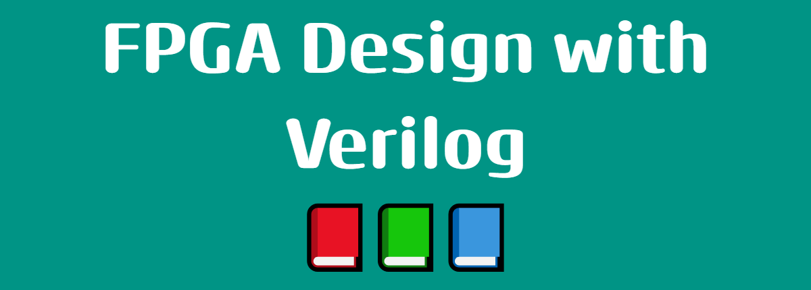

# FPGA Design with Verilog

<figure markdown>
  { width="600" }
</figure>

## Contibuciones
Las contribuciones a este proyecto son bienvenidas en cualquier formato: informes de errores, comentarios, pull requests, etc.

## Autores
- Guadalupe Alonso Contreras - [LinkedIn](https://www.linkedin.com/in/guadalupe-alonso-b099811ab/) - [GitHub](https://github.com/GuadalupeAlonso)
- Ciro Fabian Bermudez Marquez - [LinkedIn](https://www.linkedin.com/in/ciro-fabian-bermudez-marquez-a93096227/) - [GitHub](https://github.com/cirofabianbermudez)
- Julisa Verdejo Palacios - [LinkedIn](https://www.linkedin.com/in/julisa-verdejo-palacios-18291b229/) - [GitHub](https://github.com/julisaverdejo)
