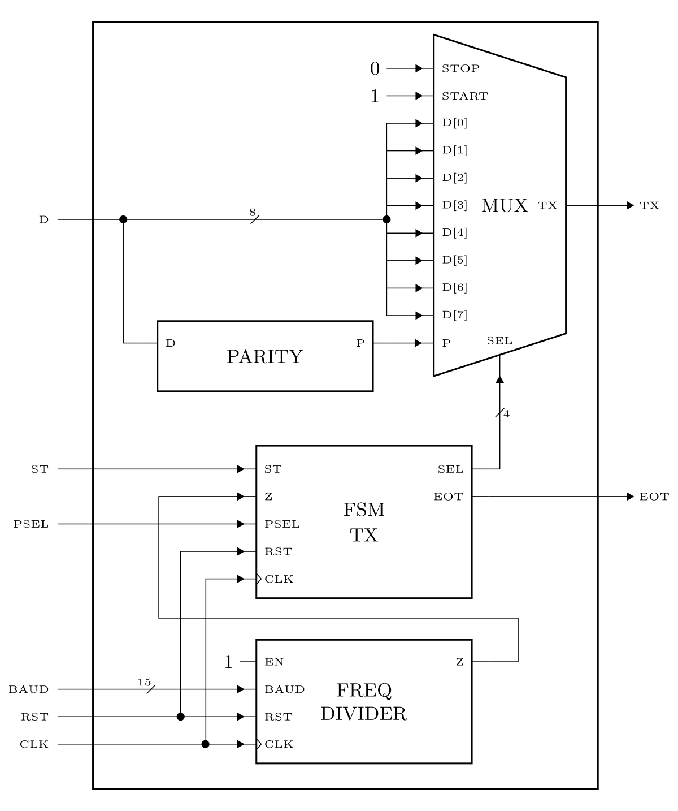

# RS232

<figure markdown>
  { width="600" }
</figure>


<figure markdown>
  { width="300" }
</figure>


<figure markdown>
  { width="700" }
</figure>


## 2. Códigos

### 2.1. Multiplexor

``` verilog title="mux_tx.v" linenums="1"
--8<-- "projects/10_rs232/verilog_codes/mux_tx.v:6"
```

### 2.2. Paridad

``` verilog title="parity.v" linenums="1"
--8<-- "projects/10_rs232/verilog_codes/parity.v:6"
```

### 2.3. Divisor de frecuencia

``` verilog title="freq_div.v" linenums="1"
--8<-- "projects/10_rs232/verilog_codes/freq_div.v:6"
```

### 2.4. FSM transmisión

``` verilog title="fsm_tx.v" linenums="1"
--8<-- "projects/10_rs232/verilog_codes/fsm_tx.v:6"
```
