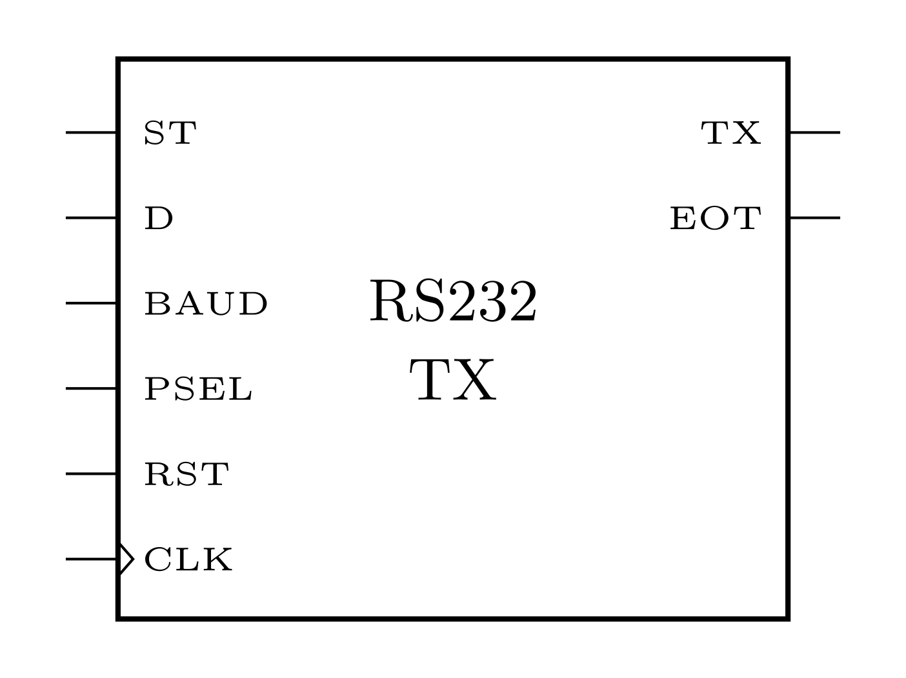

# RS232


## 1. Introtroducción

[Diagrama de tiempo](https://www.anticyclone-systems.co.uk/rs232.php)

<figure markdown>
  { width="600" }
  <figcaption><b>Figura 1.</b> Diagrama a bloques.</figcaption>
</figure>

<figure markdown>
  { width="300" }
  <figcaption><b>Figura 3.</b> Diagrama como caja negra.</figcaption>
</figure>


## 2. Códigos

### 2.1. Multiplexor

``` verilog title="mux_tx.v" linenums="1"
--8<-- "projects/10_rs232/verilog_codes/mux_tx.v:6"
```
### 2.2. Paridad

``` verilog title="parity.v" linenums="1"
--8<-- "projects/10_rs232/verilog_codes/parity.v:6"
```

### 2.3. Divisor de frecuencia

$$
\text{BAUD} = \frac{1}{9600} \cdot 100 \text{MHz}  = 10415.66 \approx 10415 
$$

$$
\log_{2} (10415) = 13.34 \approx 14
$$

``` verilog title="freq_div.v" linenums="1"
--8<-- "projects/10_rs232/verilog_codes/freq_div.v:6"
```

### 2.4. FSM transmisión

<figure markdown>
  { width="700" }
  <figcaption><b>Figura 3.</b> Máquina de estados de transmisión con protocolo Rs232.</figcaption>
</figure>

``` verilog title="fsm_tx.v" linenums="1"
--8<-- "projects/10_rs232/verilog_codes/fsm_tx.v:6"
```

### 2.5. Top

``` verilog title="rs232_tx.v" linenums="1"
--8<-- "projects/10_rs232/verilog_codes/rs232_tx.v:6"
```

## 3. Verificación

``` verilog title="rs232_tx_tb.v" linenums="1"
--8<-- "projects/10_rs232/verilog_codes/rs232_tx_tb.v:6"
```

## 4. Resultados

<figure markdown>
  { width="700" }
  <figcaption><b>Figura 4.</b> Resultados de simulación en GTKWave de transmisión con protocolo RS232.</figcaption>
</figure>


