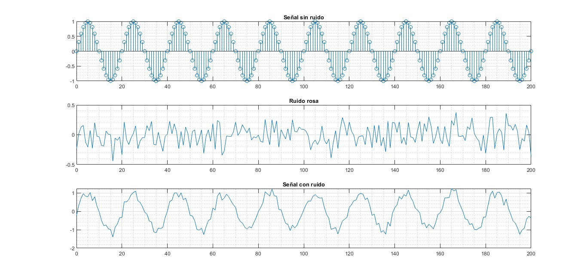
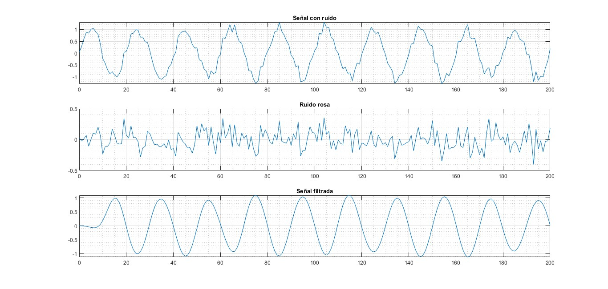
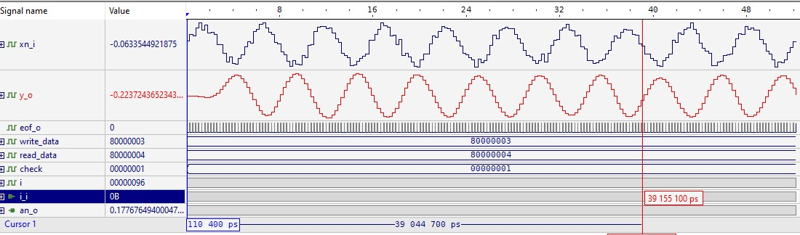
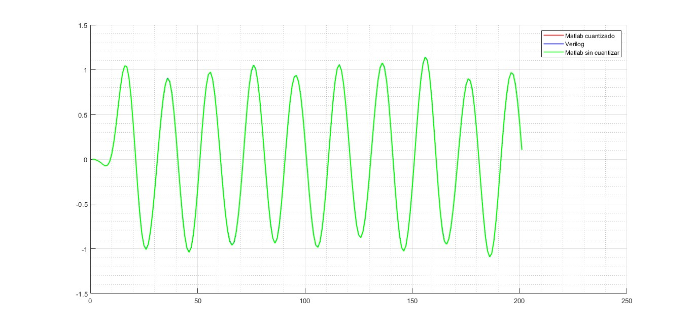
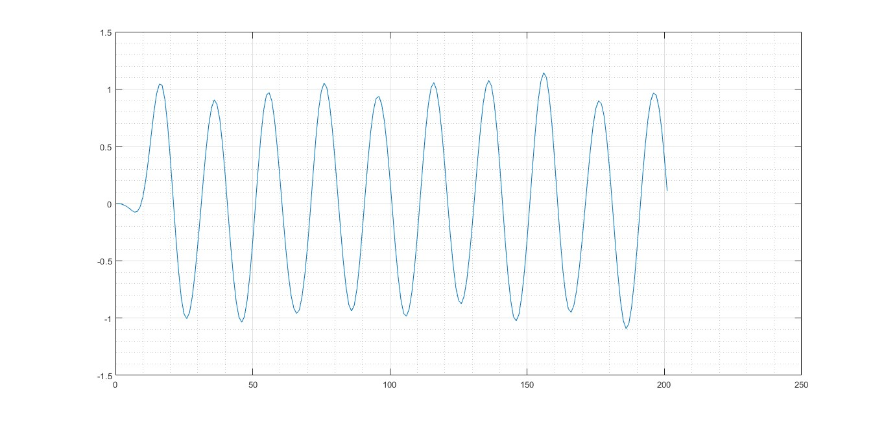

**Práctica No. 5:** Filtro FIR
**Asignatura:** DSP con FPGA
**Institución:** INAOE
**Autor:** Julisa Verdejo Palacios
**Fecha:** 20 de junio de 2023


Para implementar el filtro FIR en VERILOG primero se realizó lo siguiente:

## 1. Diseño de filtro FIR

Se diseñó un filtro FIR pasa bandas de orden 20 usando una ventana hamming en MATLAB, además se propuso una señal senoidal de $1\ KHz$ a la cual se le añadió un ruido rosa 

```matlab
clear; close all; clc;

% Definicion del problema
samples = 200;
n = 0:1:samples; % muestras
w1 = 1e3; % En Hz
Ts = (1/w1)/20; % Periodo de muestreo 10 veces periodo de la señal mas grande
x1 = 1.0*sin(2*pi*w1*Ts*n); % 2*w1*Ts
x2 = 6.0*pinknoise(1,samples+1);

x = x1+x2;
save('A1_x_values.mat', "x");

figure(1);
subplot(3,1,1), stem(n,x1), grid on; grid minor; title('Señal sin ruido');
subplot(3,1,2), plot(n,x2), grid on; grid minor; title('Ruido rosa');
subplot(3,1,3), plot(n,x), grid on; grid minor; title('Señal con ruido');

% Analisis de frecuencia
[X1,w] = freqz(x1,1);
[X2,w] = freqz(x2,1);
[X,w] = freqz(x,1);
figure(2);
subplot(3,1,1), plot(w/pi , abs(X1) ), grid on; grid minor; title('x1');
subplot(3,1,2), plot(w/pi, abs(X2) ), grid on; grid minor; title('x2');
subplot(3,1,3), plot(w/pi, abs(X) ), grid on; grid minor; title('x=x1+x2');

% Diseño de filtro
orden = 20;
h1 = fir1(orden,[0.05 0.15],hamming(orden+1)); % 250 Hz 0.05/(2*Ts)
save('A1_filter_val.mat', "h1");
figure(3); freqz(h1);

% Filtrado
y1 = filter(h1,1,x);
figure(4);
subplot(3,1,1), plot(n,x), grid on; grid minor; title('x');
subplot(3,1,2), plot(n,x2), grid on; grid minor; title('x2');
subplot(3,1,3), plot(n,y1), grid on; grid minor; title('y1');
save('A1_y_output.mat', "y1");
save('A1_all_variables.mat');


% Respuesta al impulso
figure(5);
stem(h1); grid on; grid minor;
```

**Código 1. Diseño de filtro FIR**

Este código nos arroja los siguientes archivos:

- A1_x_values.mat, guarda las señal con ruido, x.
- A1_filter_val.mat, guarda los coeficientes, h1.
- A1_y_output.mat, guarda la señal filtrada, y1.
- A1_all_variables.mat


En las siguientes imágenes se muestran la señal con ruido y la señal filtrada.

La señal con ruido se muestra a continuación:



**Fig 1. Señal con ruido rosa**



**Fig 2. Señal filtrada.**

Después se realizó el siguiente código, este se encarga de cargar A1_filter_val.mat, y cuantizar los coeficientes del filtro (h1/an), se genera la ROM de coeficientes para poder copiarla y pegarla y usarla en verilog, además crea un archivo real_coef.txt donde se guardan los coeficientes cuantizados convertidos a punto flotante.

```matlab
clear; close all; clc;

load A1_filter_val.mat;
an = h1;

file = fopen("real_coef.txt", "w");

real_coef = zeros(1,numel(an));
for i = 1:numel(an)
    res1 = d2b(36, 33, an(i));
    res2 = b2d(36, 33, res1);
    fprintf("%2d: an_o = 36'b%s; // %40.35f \n", i-1, res1, res2);
    fprintf(file,'%40.35f\n',res2);
end
% -0.00977396208327263593673706054687500
% -0.00977396208327264
% Conversion flotante a punto fijo
function f = d2b(nbits, b, value)    
    aux = value*2^b;
    aux2 = fix(aux);     
    r = dec2bin(aux2,nbits);  
    f = r(end-nbits+1:end);    
end

% Conversion punto fijo a flotante
function f = b2d(nbits, b, value)                        
    detector = str2double(value(1));   
    aux = bin2dec(value) - detector*2^(nbits); 
    f = aux/(2^b);     
end
```

**Código 2. Cuantización y conversión.**

El siguiente código en MATLAB se encarga de cargar el archivo A1_x_values.mat, y cuantizar la señal con ruido, guardando un archivo x_values.txt en binario, además, guarda un archivo x_values_real.txt que contienen los valores cuantizados convertidos a punto flotante.

```matlab
clear; close all; clc;

load A1_x_values.mat;
x_values = x;

file = fopen("x_values.txt", "w");
file2 = fopen("x_values_real.txt", "w");

check = zeros(1,201);
for i = 1:numel(x_values)
    res = d2b(18, 15, x_values(i));
    check(i) = b2d(18, 15, res);
    fprintf(file,'%s\n',res);
    fprintf("%3d: %20.17f\n",i,check(i));
    fprintf(file2,'%20.17f\n',check(i));
end

fclose(file);
fclose(file2);

% Conversion flotante a punto fijo
function f = d2b(nbits, b, value)    
    aux = value*2^b;
    aux2 = fix(aux);     
    r = dec2bin(aux2,nbits);  
    f = r(end-nbits+1:end);    
end

% Conversion punto fijo a flotante
function f = b2d(nbits, b, value)                        
    detector = str2double(value(1));   
    aux = bin2dec(value) - detector*2^(nbits); 
    f = aux/(2^b);     
end
```

**Código 3. Cuantización y conversión.**

Una vez generado este archivo, debemos copiar el documento x_values.txt al Workspace de Active HDL.


## 2. Implementación en VERILOG

A continuación se muestran los bloques que deben ser implementados en VERILOG


**Fig 3. Diagrama a bloques de filtro FIR.**

En resumen, las entradas y salidas del filtro FIR son las siguientes:


**Fig 4. Filtro FIR como caja negra.**

En este reporte sólo se mostrarán los códigos de los nuevos bloques a implementar.

La ROM de coeficientes del filtro FIR es la siguiente:

```veril
module coeficientes
	(
	input		[5:0]	i_i,
	output reg	[35:0]	an_o
	);
	
	always@(i_i)
		case(i_i)			
			  0: an_o = 36'b111111111010111111101110100001000001; //   -0.00977396208327263593673706054687500 
			 1: an_o = 36'b111111111001010011101001101011011010; //   -0.01307216729037463665008544921875000 
			 2: an_o = 36'b111111110101111001101101000010111100; //   -0.01972339348867535591125488281250000 
			 3: an_o = 36'b111111110011011000011011010001010100; //   -0.02464519953355193138122558593750000 
			 4: an_o = 36'b111111110101101000010110001101000100; //   -0.02025308413431048393249511718750000 
			 5: an_o = 36'b000000000000000000000000000000000000; //    0.00000000000000000000000000000000000 
			 6: an_o = 36'b000000010011011000000101001100111010; //    0.03784427721984684467315673828125000 
			 7: an_o = 36'b000000101101000101110010010100011111; //    0.08806720736902207136154174804687500 
			 8: an_o = 36'b000001000111010100101000011111011101; //    0.13930153439287096261978149414062500 
			 9: an_o = 36'b000001011010111110000110100111010110; //    0.17767649400047957897186279296875000 
			10: an_o = 36'b000001100010010000100011001010010011; //    0.19191129726823419332504272460937500 
			11: an_o = 36'b000001011010111110000110100111010110; //    0.17767649400047957897186279296875000 
			12: an_o = 36'b000001000111010100101000011111011101; //    0.13930153439287096261978149414062500 
			13: an_o = 36'b000000101101000101110010010100011111; //    0.08806720736902207136154174804687500 
			14: an_o = 36'b000000010011011000000101001100111010; //    0.03784427721984684467315673828125000 
			15: an_o = 36'b000000000000000000000000000000000000; //    0.00000000000000000000000000000000000 
			16: an_o = 36'b111111110101101000010110001101000100; //   -0.02025308413431048393249511718750000 
			17: an_o = 36'b111111110011011000011011010001010100; //   -0.02464519953355193138122558593750000 
			18: an_o = 36'b111111110101111001101101000010111100; //   -0.01972339348867535591125488281250000 
			19: an_o = 36'b111111111001010011101001101011011010; //   -0.01307216729037463665008544921875000 
			20: an_o = 36'b111111111010111111101110100001000001; //   -0.00977396208327263593673706054687500 
			default: an_o = 36'b000000000000000000000000000000000000; // 0	 	
			
		endcase
endmodule
```

**Código 4. ROM de coeficientes de filtro FIR.**

El multiplexor que seleccionará que coeficiente y valor de la señal con ruido se multiplicará se muestra a continuación:

```verilog
module mux_reg #(
	parameter n = 18
)	(
	input [n-1:0] x0_i,
	input [n-1:0] x1_i,
	input [n-1:0] x2_i,
	input [n-1:0] x3_i,
	input [n-1:0] x4_i,	
	input [n-1:0] x5_i,
	input [n-1:0] x6_i,	
	input [n-1:0] x7_i,
	input [n-1:0] x8_i,	
	input [n-1:0] x9_i,
	input [n-1:0] x10_i,	
	input [n-1:0] x11_i,	
	input [n-1:0] x12_i,
	input [n-1:0] x13_i,
	input [n-1:0] x14_i,	
	input [n-1:0] x15_i,
	input [n-1:0] x16_i,
	input [n-1:0] x17_i,
	input [n-1:0] x18_i,
	input [n-1:0] x19_i,
	input [n-1:0] x20_i,
	input [5:0] i_i,
	output reg [n-1:0] x_o
	);
	
	always@(i_i)
		case(i_i)			
			 0 : x_o = x0_i; 
			 1 : x_o = x1_i; 
			 2 : x_o = x2_i; 
			 3 : x_o = x3_i; 
			 4 : x_o = x4_i; 
			 5 : x_o = x5_i; 
			 6 : x_o = x6_i; 
			 7 : x_o = x7_i; 
			 8 : x_o = x8_i; 
			 9 : x_o = x9_i; 
			10 : x_o = x10_i; 
			11 : x_o = x11_i; 
			12 : x_o = x12_i; 
			13 : x_o = x13_i; 
			14 : x_o = x14_i; 
			15 : x_o = x15_i; 
			16 : x_o = x16_i; 
			17 : x_o = x17_i; 
			18 : x_o = x18_i; 
			19 : x_o = x19_i; 
			20 : x_o = x20_i; 
			default : x_o = 0;			
		endcase	
endmodule
```

**Código 5. Multiplexor.**

Y la máquina de estados que habilitará cada registro se muestra a continuación:


**Fig 5. FSM que habilita registros.**

```verilog
module	fsm_reg
	(
	input 		clk_i,
	input 		rst_i,
	input		eof_i,
	output reg	ldx_o
	);
	
	reg [1:0] present_state = 0;
	reg [1:0] next_state = 0;
	
	always@(eof_i, present_state) begin
		present_state = next_state;
		case(present_state)
			0 : begin
					ldx_o = 0;
					if(eof_i)
						next_state = present_state;
					else
						next_state = 1;				
				end
			
			1 : begin
					ldx_o = 0;
					if(eof_i)
						next_state = 2;
					else
						next_state = present_state;
				end
			
			2 : begin
				ldx_o = 1;
				next_state = 0;
				end
		endcase		
	end
	
	always@(posedge clk_i, posedge rst_i) begin
		if(rst_i)
			present_state <= 0;
		else
			present_state <= next_state;	
	end
	
endmodule
```

**Código 6. FSM habilitación de LDX.**

Finalmente el archivo top en verilog es el siguiente:

```verilog
module top_fir
	(
	input 			clk_i,
	input 			rst_i,
	input			stf_i,
	input	[17:0]	xn_i,
	output	[17:0]	y_o,
	output			eof_o
	);
	
	wire [5:0] i, n, s;
	wire eof, ldx;
	wire [17:0] x;
	wire [35:0] an;
	wire [17:0] x1,x2,x3,x4,x5,x6,x7,x8,x9,x10,x11,x12,x13,x14,x15,x16,x17,x18,x19,x20;
	
	flip_flop_hab	#(.n(18))	mod_ff1	(			
		.clk_i,
		.rst_i,
		.hab_i(ldx),
		.d_i(xn_i),
		.q_o(x1)		
	);
	
	flip_flop_hab	#(.n(18))	mod_ff2	(
		.clk_i,
		.rst_i,
		.hab_i(ldx),
		.d_i(x1),
		.q_o(x2)		
	);

	flip_flop_hab	#(.n(18))	mod_ff3	(	
		.clk_i,
		.rst_i,
		.hab_i(ldx),
		.d_i(x2),
		.q_o(x3)		
	);
	
	flip_flop_hab	#(.n(18))	mod_ff4	(	
		.clk_i,
		.rst_i,
		.hab_i(ldx),
		.d_i(x3),
		.q_o(x4)		
	); 
	
	flip_flop_hab	#(.n(18))	mod_ff5	(
		.clk_i,
		.rst_i,
		.hab_i(ldx),
		.d_i(x4),
		.q_o(x5)		
	);
	
	flip_flop_hab	#(.n(18))	mod_ff6	(	
		.clk_i,
		.rst_i,
		.hab_i(ldx),
		.d_i(x5),
		.q_o(x6)		
	);	
	
	flip_flop_hab	#(.n(18))	mod_ff7	(			
		.clk_i,
		.rst_i,
		.hab_i(ldx),
		.d_i(x6),
		.q_o(x7)		
	);
	
	flip_flop_hab	#(.n(18))	mod_ff8	(		
		.clk_i,
		.rst_i,
		.hab_i(ldx),
		.d_i(x7),
		.q_o(x8)		
	);
	
	flip_flop_hab	#(.n(18))	mod_ff9	(		
		.clk_i,
		.rst_i,
		.hab_i(ldx),
		.d_i(x8),
		.q_o(x9)		
	);
	
	flip_flop_hab	#(.n(18))	mod_ff10 (				
		.clk_i,
		.rst_i,
		.hab_i(ldx),
		.d_i(x9),
		.q_o(x10)		
	);
	
	flip_flop_hab	#(.n(18))	mod_ff11 (	
		.clk_i,
		.rst_i,
		.hab_i(ldx),
		.d_i(x10),
		.q_o(x11)		
	);
	
	flip_flop_hab	#(.n(18))	mod_ff12 (		
		.clk_i,
		.rst_i,
		.hab_i(ldx),
		.d_i(x11),
		.q_o(x12)		
	);
	
	flip_flop_hab	#(.n(18))	mod_ff13 (		
		.clk_i,
		.rst_i,
		.hab_i(ldx),
		.d_i(x12),
		.q_o(x13)		
	);
	
	flip_flop_hab	#(.n(18))	mod_ff14 (		
		.clk_i,
		.rst_i,
		.hab_i(ldx),
		.d_i(x13),
		.q_o(x14)		
	);
	
	flip_flop_hab	#(.n(18))	mod_ff15 (	
		.clk_i,
		.rst_i,
		.hab_i(ldx),
		.d_i(x14),
		.q_o(x15)		
	);	
	
	flip_flop_hab	#(.n(18))	mod_ff16 ( 	
		.clk_i,
		.rst_i,
		.hab_i(ldx),
		.d_i(x15),
		.q_o(x16)		
	);	
	
	flip_flop_hab	#(.n(18))	mod_ff17 (	
		.clk_i,
		.rst_i,
		.hab_i(ldx),
		.d_i(x16),
		.q_o(x17)		
	);
	
	flip_flop_hab	#(.n(18))	mod_ff18 (
		.clk_i,
		.rst_i,
		.hab_i(ldx),
		.d_i(x17),
		.q_o(x18)		
	);
	
	flip_flop_hab	#(.n(18))	mod_ff19	(
		.clk_i,
		.rst_i,
		.hab_i(ldx),
		.d_i(x18),
		.q_o(x19)		
	);
	
	flip_flop_hab	#(.n(18))	mod_ff20 (	
		.clk_i,
		.rst_i,
		.hab_i(ldx),
		.d_i(x19),
		.q_o(x20)		
	);	
	
	mux_reg	#(.n(18)) mod_mux	(		
		.x0_i(xn_i),
		.x1_i(x1),
		.x2_i(x2),
		.x3_i(x3),
		.x4_i(x4),  
		.x5_i(x5),
		.x6_i(x6),  
		.x7_i(x7),
		.x8_i(x8),  
		.x9_i(x9),
		.x10_i(x10), 
		.x11_i(x11), 
		.x12_i(x12),
		.x13_i(x13),
		.x14_i(x14), 
		.x15_i(x15),
		.x16_i(x16),
		.x17_i(x17),
		.x18_i(x18),
		.x19_i(x19),
		.x20_i(x20),
		.i_i(i),
		.x_o(x)
	);
	
	assign s = 6'b100001;
	assign n = 6'b010100;  
	
	top_mac	mod_mac	(
		.clk_i,
		.rst_i,
		.stf_i,
		.x_i(x),
		.a_i(an),
		.n_i(n),
		.s_i(s),
		.y_o,
		.i_o(i),
		.eof_o(eof)	
	);		
	
	fsm_reg	mod_fsm_reg	(
		.clk_i,
		.rst_i,
		.eof_i(eof),
		.ldx_o(ldx)	
	);
	
	coeficientes	mod_coeficientes (
		.i_i(i),
		.an_o(an)	
	);
	
	assign eof_o = eof;
endmodule
```

**Código 7. Archivo top.**

El testbench de el filtro FIR se muestra a continuación:

```verilog
`timescale 1 ns / 100 ps

module tb_fir ();
	reg					clk_i;
	reg					rst_i;
	reg					stf_i;
	reg signed	[17:0]	xn_i;
	reg	signed	[17:0]	y_o;
	reg					eof_o;
	
	
	// Instanciacion del modulo
	top_fir	DUT	(
		.clk_i,
		.rst_i,
		.stf_i,
		.xn_i,
		.y_o,
		.eof_o
	);
			
	// Generador de señal de reloj y reset
  	initial begin
    	clk_i = 0; rst_i = 1; stf_i = 0; #10;
        		   rst_i = 0;            #10;
  	end
  
 	always #5 clk_i = ~clk_i; // 100 MHz clock (50*1 ns*2) con 50% duty-cycle
	
	// variables para lectura y escritura de archivos 
	integer write_data, read_data, check;
  	int i;
  	localparam SF = 2.0**-15.0;
  
	// Estímulo de las entradas
	initial begin
    	write_data = $fopen("tb_output.txt","w");  
		read_data = $fopen("x_values.txt","r");
		#50; 
		
    	// run 50 + (340)*iter ns : run 52310 ns
    	for (i = 0; i < 201; i++) begin  
			// Leer una linea del archivo de texto
			check = $fscanf(read_data,"%b\n",xn_i); #10;	  
			
			// Empezar filtro
			stf_i = 1; #10;
	   	 	stf_i = 0;
			
			// Esperar a que termine y escribir el resultado
			#210;					 
      		$fdisplay(write_data, "%32.27f",$itor(y_o)*SF);
			
			// Esperar a que recorra
      		#30;
    	end		
		
		#1000;
		$fclose(write_data);  // close the files
		$fclose(read_data);
	end
    	 

endmodule
```

**Código 8. Testbench.**

El testbench genera un archivo tb_output.txt, este deberá copiarse en el Workspace de MATLAB para ver el resultado de la señal filtrada que arrojó Active HDL.

El resultado de la simulación es el siguiente:



**Fig 6. Resultado de señal filtrada con filtro FIR.**

En la imagen anterior se puede apreciar la señal con ruido `xn_i` y la señal filtrada `y_o`.


## 3. Comparación de resultados

Se realizaron algunos cálculos de error y comparación de resultados en el siguiente código:

```matlab
clear; close all; clc;

% Filtro cuantizado
x = load("x_values_real.txt");
an = load("real_coef.txt");
yn = filter(an,1,x);

% Simulacion sin cuantizazar
load("A1_y_output.mat");
yn_sin_cuant = y1;

% Cargar simulacion de verilog
yn_p = load('tb_output.txt');

grosor = 1.2;
figure(1);
hold on;
plot(yn,'r',"DisplayName","Matlab cuantizado","LineWidth",grosor);
plot(yn_p,'b',"DisplayName","Verilog","LineWidth",grosor)
plot(yn_sin_cuant,'g',"DisplayName","Matlab sin cuantizar","LineWidth",grosor)
grid on; grid minor;
legend();

figure(2);
error = yn - yn_p;
plot(error);
grid on; grid minor;
fprintf("Error maximo = %f%%\n", max(abs(error))*100);
```

**Código 9. Comparación de resultados**



**Fig 7. Comparación de resultados.**

En la imagen se puede notar que la señal filtrada es muy parecida en sus 3 variantes. esto quiere decir que el error es muy pequeño:

```matlab
Error maximo = 0.735736%
```

Finalmente si se quiere observar la señal filtrada directamente de verilog se debe ejecutar el siguiente código en MATLAB.

```matlab
clear; close all; clc;

data = load("tb_output.txt");
plot(data); grid on; grid minor;
```

**Código 10. Visualización de señal filtrada.**

La señal filtrada se muestra a continuación:



**Fig 8. Señal filtrada de VERILOG.**